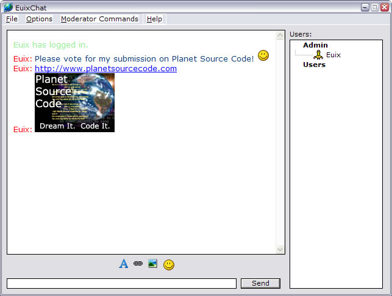



## EuixChat Chatroom

### Description

My chatroom uses a seperate central server, so that everyone all connects to one place. This is what some major chat system do, such as AIM and MSN. My chatroom includes Private Messages, Color Coded Names, Custom Font Settings, Administration Commands, and a few other easter eggs. Have fun, and please vote! :)
 
### More Info
 

             |
---                |---
**Submitted On**   |2004-01-19 13:47:18
**By**             |[Euix](https://github.com/Planet-Source-Code/PSCIndex/blob/master/ByAuthor/euix.md)
**Level**          |Advanced
**User Rating**    |4.6 (23 globes from 5 users)
**Compatibility**  |VB 6\.0
**Category**       |[Internet/ HTML](https://github.com/Planet-Source-Code/PSCIndex/blob/master/ByCategory/internet-html__1-34.md)
**World**          |[Visual Basic](https://github.com/Planet-Source-Code/PSCIndex/blob/master/ByWorld/visual-basic.md)
**Archive File**   |[EuixChat\_C1696581192004\.zip](https://github.com/Planet-Source-Code/euix-euixchat-chatroom__1-51109/archive/master.zip)

